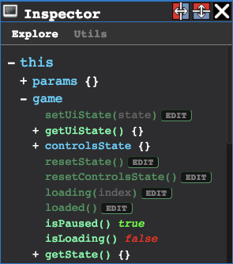

# Version history

### [v0.1.1](https://github.com/agrande/lba2remake/compare/v0.1.0...v0.1.1) Bugfixes

Add Y as back button on Oculus Touch controller

## [v0.1.0](https://github.com/agrande/lba2remake/compare/v0.0.15...v0.1.0) Major release
_November 9th, 2019_

This is a major release, but there is still a lot of work to do!

#### VR

The game can now be played in VR!!!

Tested devices:
- Oculus Quest
- Oculus Rift
- Oculus Go

Should also work on (but not tested):
- HTC Vive
- Gear VR

#### Gameplay

- Bonuses work in a basic way (no gravity)
- Doors can be opened and closed
- Fixed many bugs that were affecting gameplay

#### Graphics (3D + Iso)

Major graphics upgrade for both indoor and outdoor views.
- Some sprites are now displayed (mostly) correctly, like doors
- Isometric scenes are resolution-independant
- 3D scenes have texture filtering
- Character textures are fixed
- Improved shaders

#### Editor

- Improved the scripting area
- Created new icons for the editor
- New editors: model and island editors

#### Bug fixes

Too many to list!

-----------------------------

### [v0.0.15](https://github.com/agrande/lba2remake/compare/v0.0.14...v0.0.15) Bugfixes
_May 3rd, 2018_

- Context menu in editor was broken
- All zones in the game are now named (thanks SendellX)

-----------------------------

### [v0.0.14](https://github.com/agrande/lba2remake/compare/v0.0.13...v0.0.14) Editor: Inspector area
_May 1st, 2018_

The inspector area lets you take a look at the remake's game engine internals, this is a useful feature for debugging or learning how the engine works.

A video tutorial is available [here](https://youtu.be/qgCQObDvZbI) (for developpers)

Also in this release:
- Collisions between actors
- All actors in the game are now named (thanks SendellX)
- Various bugfixes

-----------------------------

### [v0.0.13](https://github.com/agrande/lba2remake/compare/v0.0.12...v0.0.13) Editor improvements
_April 17th, 2018_

- Use arrow keys to navigate between actors/zones/points
- Switching scenes while video is playing stops the video
- Switching scenes when paused keeps the game paused
- Allow moving around with free camera when game is paused
- Automatically select text when renaming object
- Various bugfixes

-----------------------------

### [v0.0.12](https://github.com/agrande/lba2remake/compare/v0.0.11...v0.0.12) Editor: Metadata improvements
_April 15th, 2018_

- Allow using "Enter" key to rename objects (in addition to "F2")
- Object renaming field now has the current value pre-set

-----------------------------

### [v0.0.11](https://github.com/agrande/lba2remake/compare/v0.0.10...v0.0.11) New server
_April 15th, 2018_

- Server moved to https://www.lba2remake.net
- New metadata backend allowing review

-----------------------------

### [v0.0.10](https://github.com/agrande/lba2remake/compare/v0.0.9...v0.0.10) Loader
_April 7th, 2018_

- New spinning loader animation
- New changelog
- Various bugfixes (mostly audio-related)

-----------------------------

### [v0.0.9](https://github.com/agrande/lba2remake/compare/v0.0.8...v0.0.9) Isometric camera improvements
_March 29th, 2018_

- Isometric camera now follows Twinsen
- Editor: Various improvements on entering metadata
- Editor: Hovering on actor/zone/point highlights it in 3D view
- Various bugfixes (mostly Firefox-related) and improvements

-----------------------------

### [v0.0.8](https://github.com/agrande/lba2remake/compare/v0.0.7...v0.0.8) Stability
_March 23rd, 2018_

- Fixed various crashes and bugs
- Cleanly separated game mode from editor mode

-----------------------------

### [v0.0.7](https://github.com/agrande/lba2remake/compare/v0.0.6...v0.0.7) Metadata system
_March 15th, 2018_

Support editing metadata directly from the public server (doing this previously required cloning the github project)

-----------------------------

### [v0.0.6](https://github.com/agrande/lba2remake/compare/v0.0.5...v0.0.6) Basic fan translations support
_March 15th, 2018_

- Added basic support for fan translations (not visible yet)
- New crash reporting system
- Various gameplay bugfixes

-----------------------------

### [v0.0.5](https://github.com/agrande/lba2remake/compare/v0.0.4...v0.0.5) Basic metadata support
_March 11th, 2018_

- Support editing metadata from the public server (work in progress)
- Multilingual support (not visible yet)
- Some gameplay bugfixes

-----------------------------

### [v0.0.4](https://github.com/agrande/lba2remake/compare/v0.0.3...v0.0.4) Minor bugfixes
_February 26th, 2018_

Various small bugfixes (mostly related to dialogues and audio)

-----------------------------

### [v0.0.3](https://github.com/agrande/lba2remake/compare/v0.0.2...v0.0.3) Font, sprites, menus
_February 13th, 2018_

- Updated font to match original game (thanks Jasiek)
- Show raw sprites (eg. Magicball in Twinsen's Secret Room)
- Main Menu - resume and new game
- In-Game Menu - Pause and resume game with in-game menu (Esc key)
- Play intro video on New Game
- Various bugfixes (thanks Jasiek and Knappen)

-----------------------------

### [v0.0.2](https://github.com/agrande/lba2remake/compare/v0.0.1...v0.0.2) Changelog file
_February 7th, 2018_

- Display a changelog (not this one, it was changed since then)
- Various bugfixes

-----------------------------

## [v0.0.1](https://github.com/agrande/lba2remake/releases/tag/v0.0.1) First public release
_February 1st, 2018_

This is the first version to be published, the project was secret before that.
