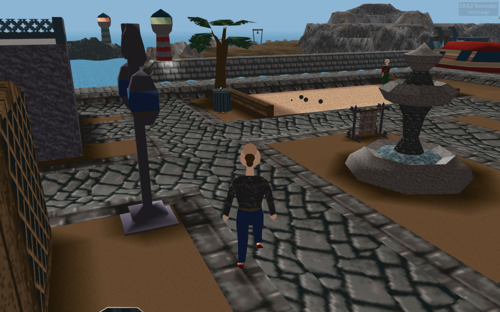
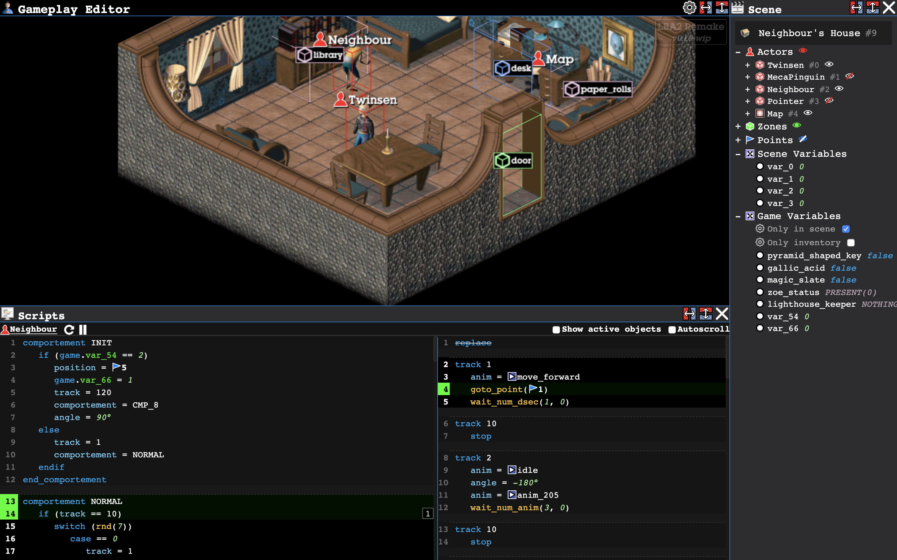

# LBA2 Remake
A Little Big Adventure 2 / Twinsen's Odyssey reimplementation in JavaScript / Three.js / React

#### [Live demo](http://lba2remake.xesf.net) (or [Editor mode](http://lba2remake.xesf.net/#editor=true))

## Vision / goals

#### Phase 1: Reimplement the LBA2 game engine
  * Should look and play like the original
  * Full re-engineering instead of dissassembly-based approach
  * Focus on code quality, make it easy to read and modify
  * __Milestones: [Gameplay 1](https://github.com/agrande/lba2remake/milestone/3), [Gameplay 2](https://github.com/agrande/lba2remake/milestone/5), [Gameplay 3](https://github.com/agrande/lba2remake/milestone/1), [Gameplay 4](https://github.com/agrande/lba2remake/milestone/4)__

#### Phase 2: Make a HD version of the game
  * Improve graphics and gameplay in a way that preserves the original look & feel
  * More of a remastered version than a remake
  * Support more platforms and ways of playing
  * __Milestones: [HD Version](https://github.com/agrande/lba2remake/milestone/9), [Social gaming](https://github.com/agrande/lba2remake/milestone/12), [Virtual Reality](https://github.com/agrande/lba2remake/milestone/7), [Alternative versions](https://github.com/agrande/lba2remake/milestone/8)__

#### Phase 3: Become a platform for modding and action/adventure game development
  * Progressively add tools to the editor to support mods
  * Have all tools grouped in a single integrated platform
  * __Milestones: [Modding 1](https://github.com/agrande/lba2remake/milestone/6), [Modding 2](https://github.com/agrande/lba2remake/milestone/11), [Modding 3](https://github.com/agrande/lba2remake/milestone/10)__

## Status

Currently you can walk around every island and buildings of the original game.
Most of the graphic elements are implemented and part of the gameplay. It is not however completable at this point.
Check out the *gameplay* [milestones](https://github.com/agrande/lba2remake/milestones) to see what needs to be done before the game becomes playable from start to end.

The editor mode allows navigating around the game scenes, inspecting scene content and variables, inspecting the game engine internal variables and debugging scripts (you can set breakpoints on actor scripts).
Progress on the editor is tracked by the *modding* [milestones](https://github.com/agrande/lba2remake/milestones).

For more information, check the [FAQ](doc/FAQ.md).

## Contributing

Any help is very much appreciated!
Check the [How to Contribute](CONTRIBUTING.md) guide to know how to do that.
A list of current and past contributors can be found [here](AUTHORS.md).

## Getting started

(**[more details here](doc/getting_started.md)**)

* Make sure you own a copy of the original game: [GOG](https://www.gog.com/game/little_big_adventure_2) or [Steam](http://store.steampowered.com/app/398000/Little_Big_Adventure_2/)
* Copy the _*.HQR_, _*.OBL_, _*.ILE_ files and the _VOX_ folder from the original game install folder to _www/data_
* (TODO) Import the musics and videos as mp4 (no script available for that at this time)
* Download [Node.js](https://nodejs.org) (if you already have node.js installed, make sure it is a recent version: ~> 6.x.x)
* Run `npm install`
* Run `npm run dev-server`
* Fire up your browser at page http://localhost:8080
* Enjoy!

## Community

* [Slack](https://join.slack.com/t/lba2remake/shared_invite/enQtMzIyNzIwNDMzNTIxLTc5OGVkNjI3NGE4YjM5ZTE5YmRkODBjMzNjOTk5NGM1NGIyMTI2N2FlOTYzYjBlZjE4NzIzYWI3ZWI0YmViMmI) - For development related discussions
* [Discord](https://discord.gg/cDmFTWq)
* [MBN forum](https://forum.magicball.net/showthread.php?t=18208)
* Reddit: [r/linux_gaming](https://www.reddit.com/r/linux_gaming/comments/8049mn/a_little_big_adventure_2_twinsens_odyssey/) or [r/gamedev](https://www.reddit.com/r/gamedev/comments/80cn9u/open_source_reimplementation_of_little_big/)
* [Facebook](https://www.facebook.com/groups/twinsen/permalink/1565479966839300/)

## License

While the original Little Big Adventure 2 game executable, assets and intellectual property belong to Didier Chanfray SARL, the code within this project is released under the [MIT License](LICENSE).
That being said, if you do anything interesting with this code, please let us know, we'd love to see it!
