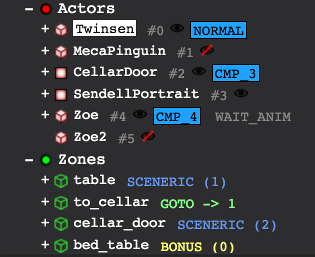
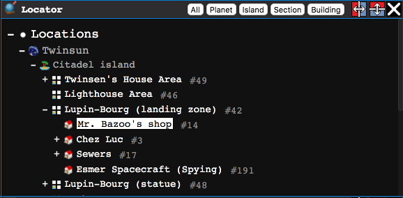
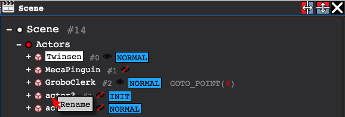

# How to Contribute : Metadata

Metadata are additional names given to different elements of the game, that are not present in the original game's data files.

We need metadata because:
 * It makes understanding the game's scripts easier
 * It helps us implement script commands better
 * It's an important step towards scripts _modding_
 
## How to edit metadata
 
 1. Fire up the online [editor](http://lba2remake.xesf.net/#editor=true) and start a game.
 2. Close the editor areas you don't need (`Scripts` and `Debug HUD`):
 
 3. Browse the scenes with the `Locator` area:
 
 4. Right click an actor or zone in the `Scene` area to rename it:
 
 5. Rename the element and press `Enter`.
 6. If it is your first contribution, fill in the _Contributor information_ form and click `Send`.
 7. Subsequent editions will remember your information when sending your edits for review.